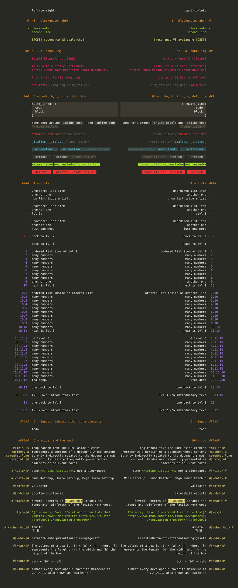

# markdown-raw

> CSS style to make HTML look like raw markdown

- leading symbols are unshifted
- right-to-left support
- uses CSS4 [`:is()`](https://developer.mozilla.org/en-US/docs/Web/CSS/:is#Browser_compatibility)
- default color theme is monokai
- css-code itself is [haskell-styled](https://en.wikipedia.org/wiki/Indentation_style#Haskell_style)

## preview
- [preview.html](./preview.html)
- https://codepen.io/dym-sh/pen/XWKbYVP/left/?editors=1100

## mirrors
- https://github.com/dym-sh/markdown-raw
- https://gitlab.com/dym-sh/markdown-raw
- https://dym.sh/markdown-raw
- hyper://a6550ce6b9d002377ec9d17603cb70e3fa67e533204738831eb3a54557edc8a4 /[?](https://beakerbrowser.com)

## license
[mit](./license)
