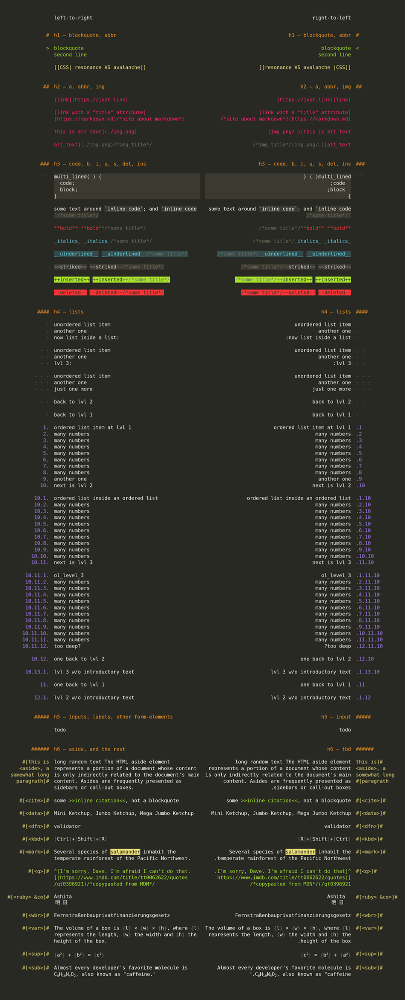

# markdown.raw()

> CSS style to make HTML look like raw markdown

- leading symbols are unshifted
- right-to-left support
- uses CSS4 [`:is()`](https://developer.mozilla.org/en-US/docs/Web/CSS/:is#Browser_compatibility)
  and [`:has()`](https://developer.mozilla.org/en-US/docs/Web/CSS/:has#Browser_compatibility)
- default color theme is monokai
- css-code itself is [haskell-styled](https://en.wikipedia.org/wiki/Indentation_style#Haskell_style)

## preview
[preview.html](./preview.html)

## mirrors
- [github](https://github.com/dym-sh/markdown-raw/)
- [gitlab](https://gitlab.com/dym-sh/markdown-raw/)
- [dym.sh](https://dym.sh/lab/markdown-raw/)
- `hyper://f7a5f3d2f4ea8ed7c2b50da4b93e7563f93d05c93dc90f386609dcf3f3614b84/` [[?](https://beakerbrowser.com)]

## license
[mit](./license)
